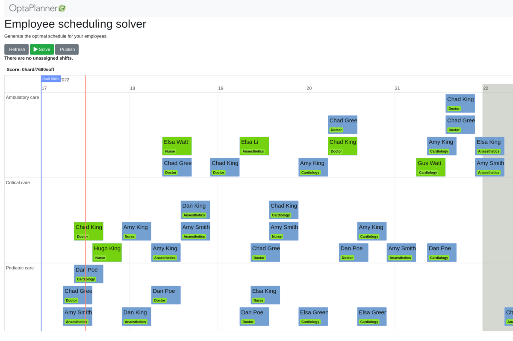

= Employee Scheduling (Python)

Schedule shifts to employees, accounting for employee availability and shift skill requirements.

* <<requirements,Requirements>>
* <<run,Run the application>>

[[requirements]]
== Requirements

* https://www.python.org[Install Python 3.9 or later.]
* https://adoptopenjdk.net[Install JDK 11 or later] with the environment variable `JAVA_HOME` configured to the JDK installation directory.

[[run]]
== Run the application

. Git clone the optapy repo and navigate to this directory:
+
[source, shell]
----
$ git clone https://github.com/optapy/optapy.git
$ cd optapy/optapy-quickstarts/employee-scheduling
----

. Activate a virtual environment
+
[source, shell]
----
$ python -m venv venv
$ . venv/bin/activate
----

. Install the quickstart requirements to the virtual environment
+
[source, shell]
----
$ pip install -r requirements.txt
----

. Run the application
+
[source, shell]
----
$ python main.py
----

. Visit http://localhost:5000/static/index.html in your browser.

. Click on the *Solve* button.

== More information

Visit https://www.optaplanner.org/[www.optaplanner.org].